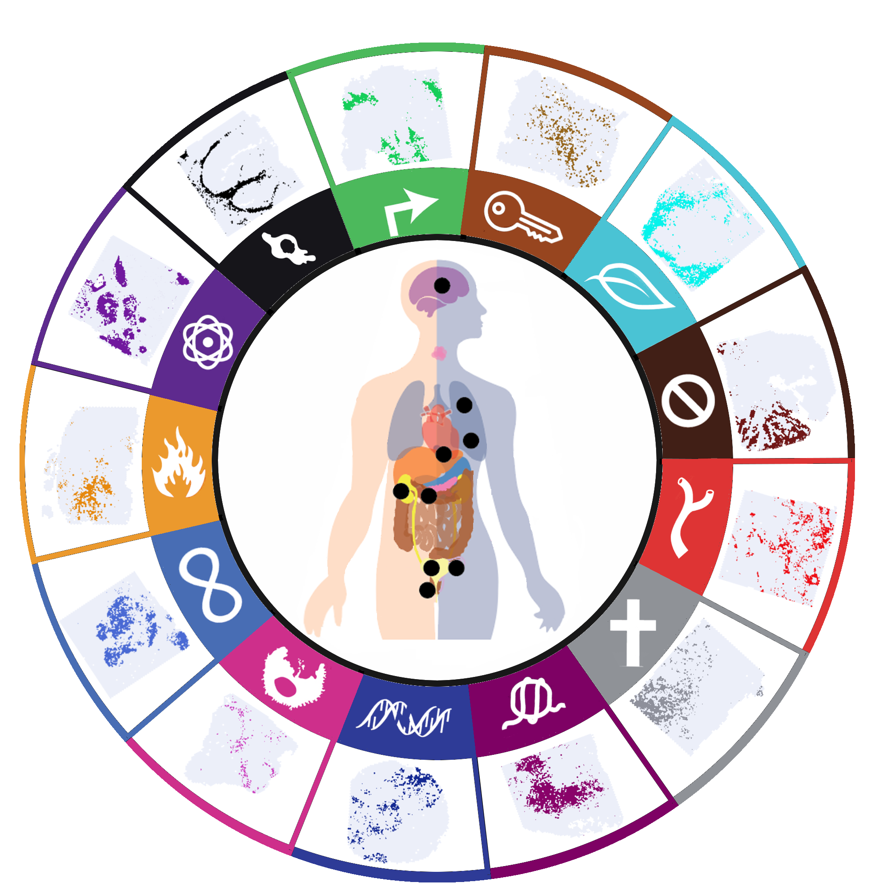

<h1>
 Unraveling the spatial architecture 
  of Cancer Hallmarks
 

  

</h1>

#### Authors: Mustafa Sibai* & Sergi Cervilla*
* Equal contribution

Code used for the collection of Cancer Hallmark gene sets and the computation of their activities in enhanced Visium samples with all downstream analysis
doi: https://doi.org/10.1101/2022.06.18.496114

## Outline
- SpaceRanger
- Processing
- Enhancing
- Hallmark gene collection
- Hallmark activity computation
- ESTIMATE computation
- Pan-Cancer heatmap
- CNV estimation
- Random Forest: Radar computation and RF models
- Pathway activities and correlations
- Plots
- Supplementary
- Utils (Annotation, Plot functions, compute real coordinates...) 

## Code purpose
- **Preprocess.R**: Preprocess samples, transform to SingleCellExperiment object and run clustering
- **EnhanceST.R**: Use BayesSpace enhancing algorithm in Visium Spatial transcriptomics data
- **GeneImputation.R**: Impute genes at sub-spot resolution
- **GeneCollection.R**: Obtain hallmark signatures using Pathway Commons
- **HallmarkScores.R**: Script to create a Seurat object from an enhanced SingleCellExperiment object
- **mat2GCT.sh**: Tranform expression matrix to GCT format
- **ComputeESTIMATE.R**: Extract enhanced expression matrix and compute ESTIMATE scores
- **PanCancerHeatmap.R**: Plot a heatmap representing and the hallmark activity within each ESTIMATE cluster
- **SpAutocorrelation**: Compute Moran's for hallmark activities
- **CNVexperiment.R**: Generate CNV clusters and run CNV experiment
- **SCD.R**: Compute Spatial Continuity Degree at sub-spot resolution
- **CancerRadar.R**: Compute TME Radar scores for Cancer spots
- **TMERadar.R**: Compute Cancer Radar scores for TME spots
- **RFCancer.R**: Generate Random Forest model to predict a given Cancer Hallmark in a given sample
- **RFTME.R**: Generate Random Forest model to predict a given TME Hallmark in a given sample
- **CancerCircos.R**: Plot results of Random Forest models for Cancer Hallmarks
- **TMECircos.R**: Plot results of Random Forest models for TME Hallmarks
- **Utils** 
  - **CoordinatesEnhanced.R**: Function to compute the real distance between sub-spots
  - **SamplesMetadata.R**: Variables with metadata and full names for hallmarks and samples
  - **PlottingMod.R**: Modifications of BayesSpace and Seurat plotting to combine and plot high resolution sub-spot plots
  - **annotLook.txt**: Gene type annotation look up table
  - **header.txt**: Header template for GCT files
- **Plots** 
  - **CreateHiresFiles.R**: Create files to plot high resolution images with enhanced BayesSpace spots
  - **HallmarkPlots.R**: Reproduce plots 

